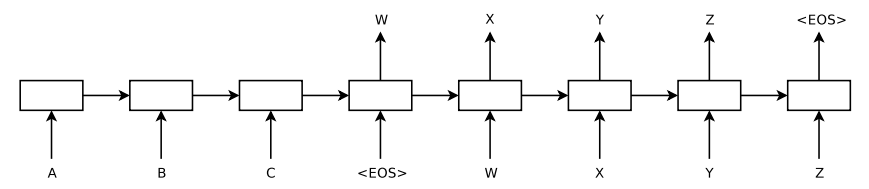
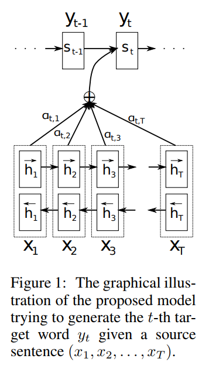

# seq2seq/encoder-decoder

seq2seq 
 
attention 
  

##  test **seq2seq**　module
- basic_rnn_seq2seq: The most basic RNN-RNN model.
- tied_rnn_seq2seq: The basic model with tied encoder and decoder weights.(i.e encoder and decoder share weights!)
- embedding_rnn_seq2seq: The basic model with input embedding.
- embedding_tied_rnn_seq2seq: The tied model with input embedding.
- embedding_attention_seq2seq: Advanced model with input embedding and  the neural attention mechanism; recommended for complex tasks.  

Each script in this repository tests one API above to solve a simple *Q&A* problem.The `seq2seq.py` that I copyed from path `tensorflow/contrib/legacy_seq2seq/python/ops`  is source code of tensorflow's seq2seq module(tensorflow1.4.1).
